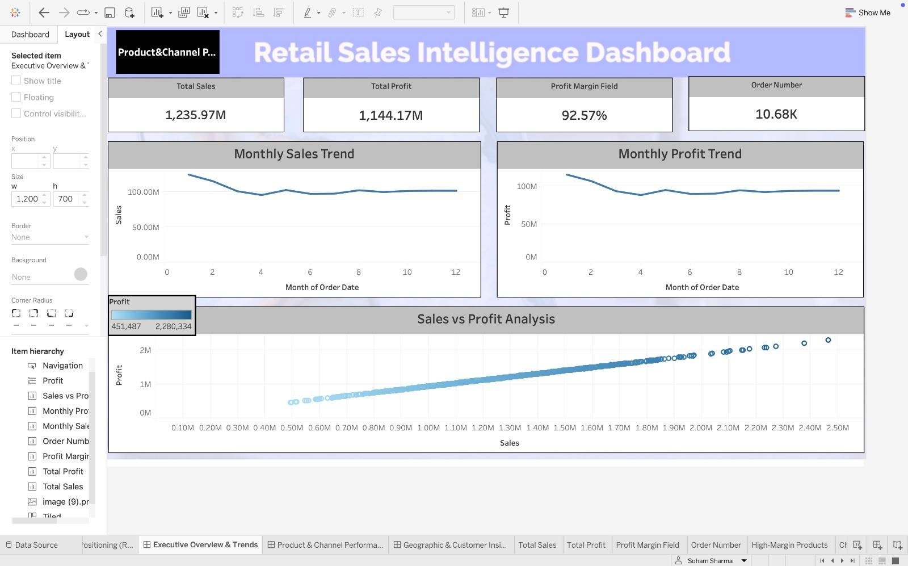
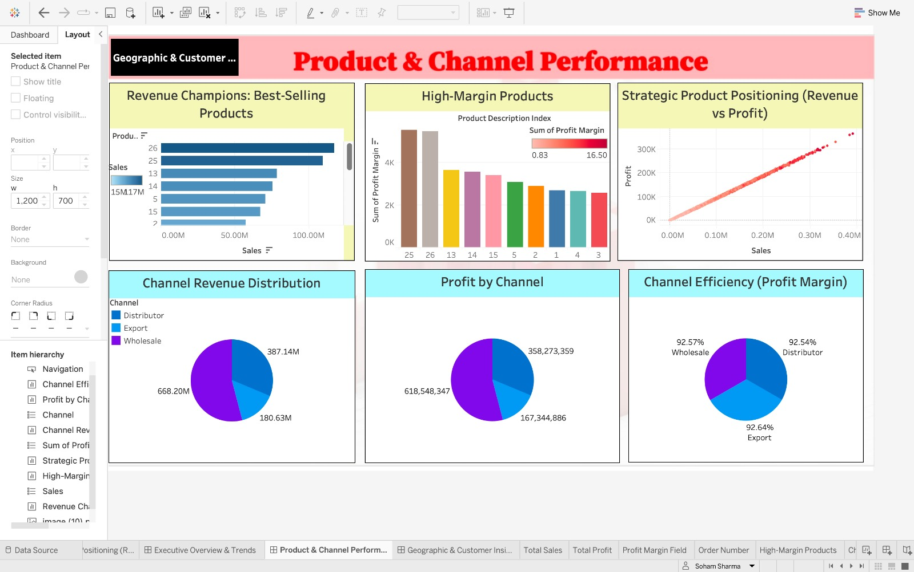
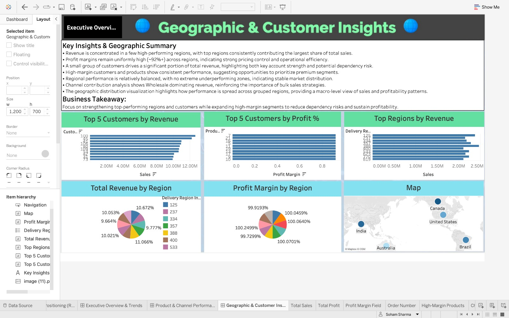

# 📊 Retail Sales Intelligence Dashboard

## 🔗 Live Dashboard

[View on Tableau Public](https://public.tableau.com/app/profile/soham.sharma8884/viz/Retail_Sales_Intelligence_Dashboard/ExecutiveOverviewTrends?publish=yes)

---

## 📌 Project Overview

This project presents an end-to-end data analytics workflow, combining Python-based exploratory data analysis (EDA) with interactive Tableau dashboards.

The goal is to extract meaningful business insights from retail sales data and present them through intuitive visualizations.

---

## 🔄 Project Workflow

### 1️⃣ Data Preparation & EDA (Python)

* Data cleaning and preprocessing
* Handling missing values
* Feature understanding and transformation
* Exploratory data analysis using visualizations
* Identifying trends in sales, profit, and customer behavior

---

### 2️⃣ Dashboard Development (Tableau)

* Built 3 interactive dashboards:

  * Executive Overview & Trends
  * Product & Channel Performance
  * Geographic & Customer Insights
* Created calculated fields (e.g., Profit Margin)
* Designed KPI cards for business metrics
* Implemented interactive navigation between dashboards
* Used custom-designed backgrounds for professional UI

---

## 📊 Dashboards

### 1️⃣ Executive Overview & Trends

* KPIs: Total Sales, Profit, Profit Margin, Orders
* Monthly trends for sales and profit
* Sales vs Profit scatter analysis

---

### 2️⃣ Product & Channel Performance

* Best-selling products
* High-margin product analysis
* Revenue vs Profit relationship
* Channel-wise revenue and profit distribution

---

### 3️⃣ Geographic & Customer Insights

* Top customers by revenue and profit
* Regional revenue distribution
* Profit margin comparison by region
* Geographic visualization using map

---

## 🛠 Tools & Technologies

* Python (Pandas, Matplotlib, Seaborn)
* Tableau
* Data Visualization
* Exploratory Data Analysis

---

## 💡 Key Insights

* Revenue is concentrated among a small group of top-performing products and regions
* Profit margins are consistently high across channels
* Wholesale channel dominates revenue contribution
* Strong positive correlation between sales and profit
* Customer segmentation reveals high-value clients
* Regional performance shows balanced distribution with growth opportunities

---

## 📁 Repository Structure

* `data/` → Dataset used for analysis
* `notebooks/` → Python EDA notebook
* `dashboards/` → Tableau workbook
* `images/` → Dashboard screenshots

---

## 🚀 Conclusion

This project demonstrates how raw data can be transformed into actionable insights through structured analysis and effective visualization.

It highlights the integration of Python for analysis and Tableau for storytelling.

---
